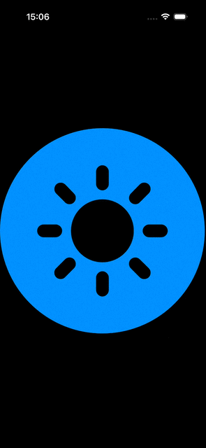

# SwiftUIRippleEffect

A lightweight SwiftUI.View modifier that adds a smooth, configurable ripple animation to any view.
Designed for buttons, taps, state changes, or moments where you want your UI to feel a bit more alive.

---

## Features

- Ripple animation triggered by any `Equatable` value  
- Customizable duration, amplitude, frequency, decay, and speed  
- Works with any SwiftUI view  
- Simple one-line integration

**Note:** Inspired by WWDC24 session 10151 — [Create custom visual effects in SwiftUI](https://developer.apple.com/wwdc24/10151/).

---

## Demo



---

## Installation

### Swift Package Manager

Add this URL to **File → Add Packages…** in Xcode:

```
https://github.com/RogyMD/SwiftUIRippleEffect.git
```

---

## Usage

```swift
import SwiftUI
import SwiftUIRippleEffect

struct ContentView: View {
  @State var rippleOrigin: CGPoint = .zero
  @State var trigger: Bool = false

  var body: some View {
    Image(systemName: "sun.max.circle.fill")
      .rippleEffect(at: rippleOrigin, trigger: trigger)
      .onTapGesture { origin in
        rippleOrigin = origin
        trigger.toggle()
      }
  }
}

```

---

### Requirements

•	iOS 17.0 or later
•	SwiftUI

---

### Contribution

Issues and pull requests are welcome!
If you’d like to improve the ripple curve, performance, or add new presets, feel free to open a discussion.

---

#### License

MIT License

